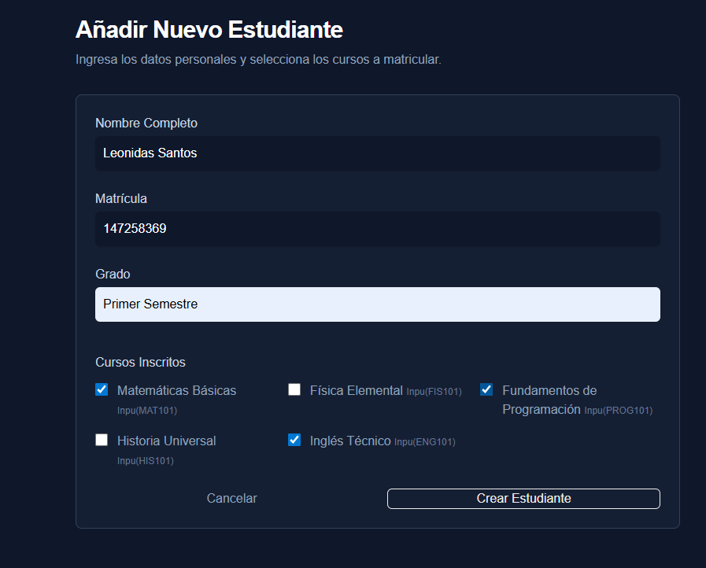
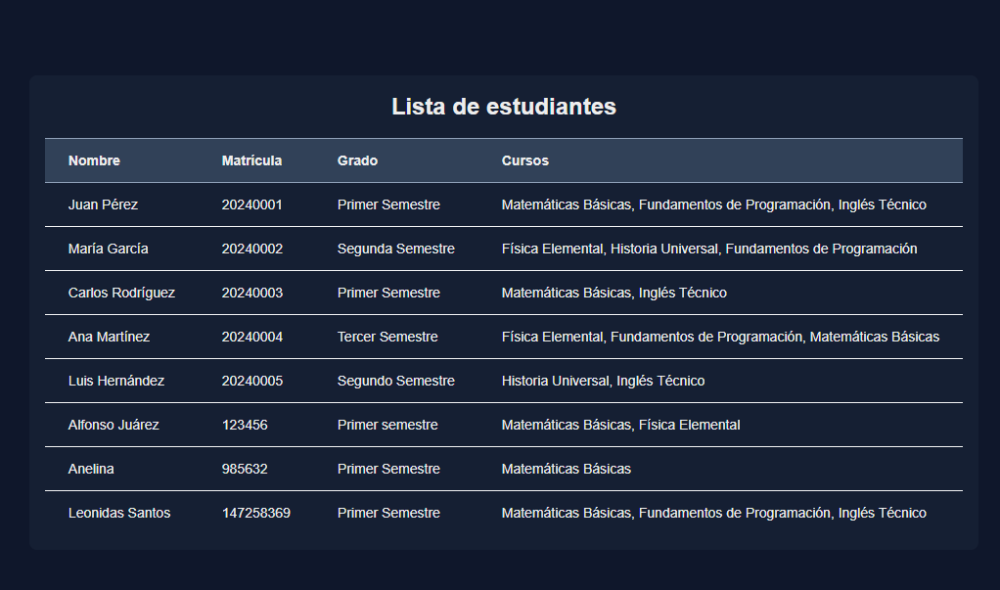
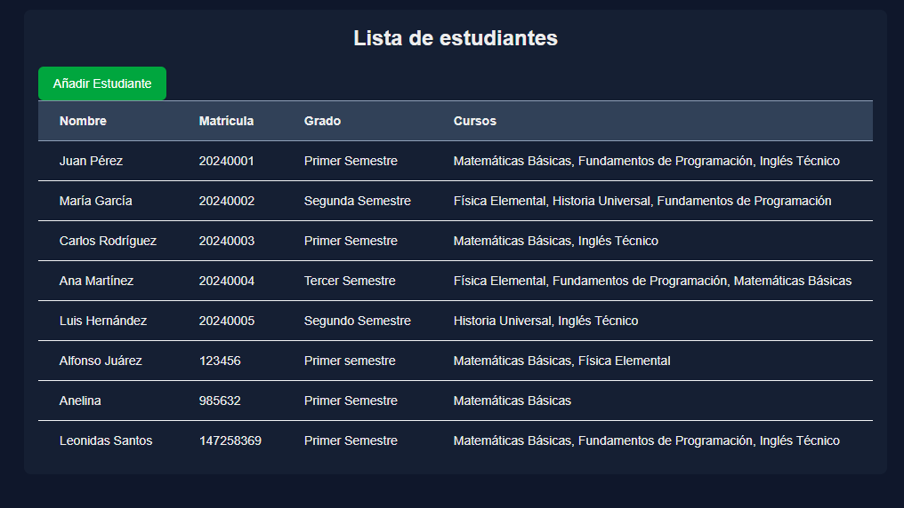
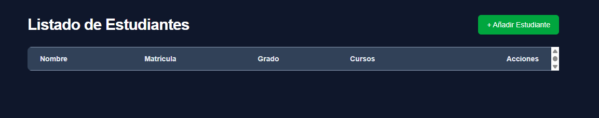
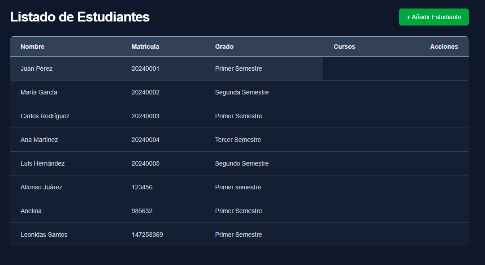
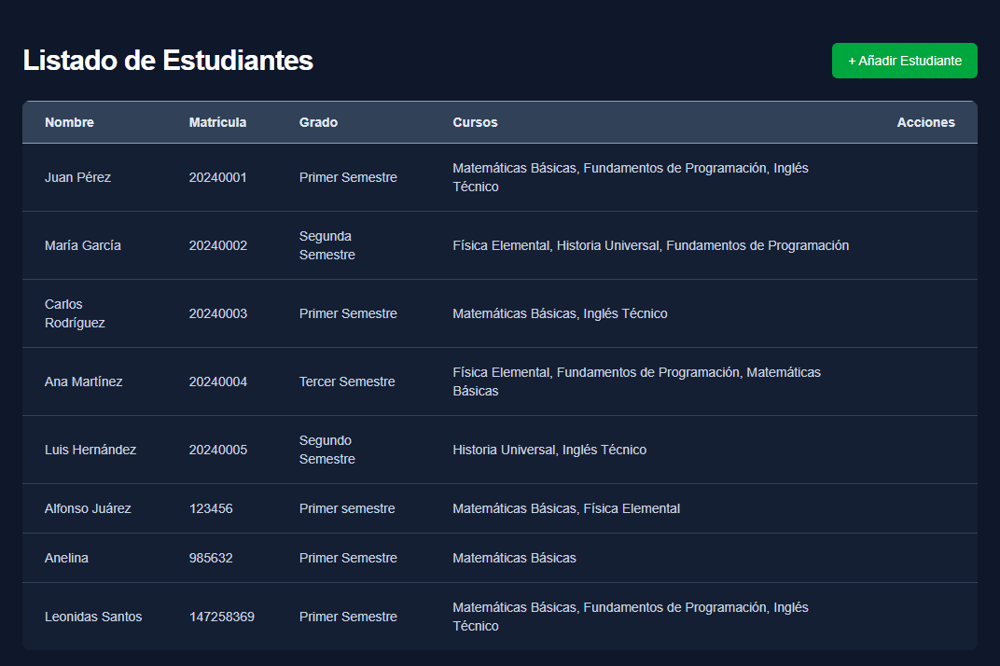
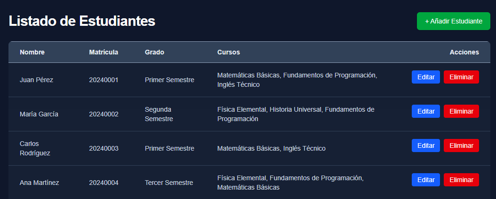
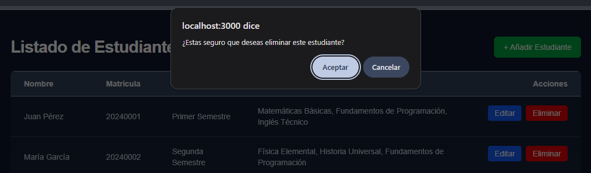
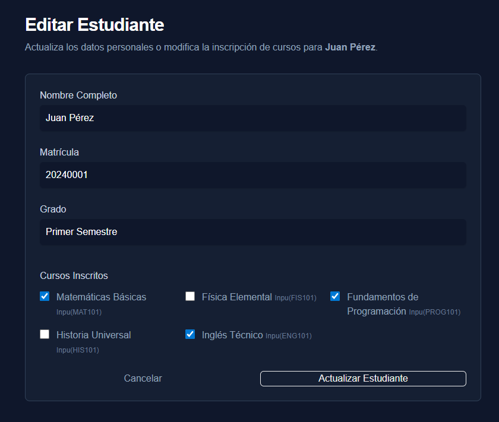

# Instalar Prisma

Instalar dependencias:

```bash
npm install prisma --save-dev
npm install @prisma/client
```

## Inicializar Prisma:

```bash
npx prisma init --datasource-provider mongodb
```

Esto generará:

```
Initialized Prisma in your project

  prisma/
    schema.prisma
  prisma.config.ts
  .env

warn You already have a .gitignore file. Don't forget to add .env in it to not commit any private information.

Next, set up your database:
  1. Configure your DATABASE_URL in prisma.config.ts
  2. Run prisma db pull to introspect your database.

Then, define your models in prisma/schema.prisma and run prisma migrate dev to apply your schema.

Learn more: https://pris.ly/getting-started
```


## Generar cliente Prisma:

```bash
npx prisma generate
```

 

Generar el cliente de Prisma (Prisma Client) a partir de los modelos definidos en schema.prisma.

Este cliente es una biblioteca TypeScript/JavaScript tipada que permite realizar consultas a la base de datos sin escribir consultas manuales.

Al tener los archivos, se puede usar el cliente para interactuar con la base de datos.

```typescript
import { PrismaClient } from "@/app/generated/prisma/client";

const prisma = new PrismaClient();

async function main() {
  const students = await prisma.student.findMany();
  console.log(students);
}

main();
```


## ejecutar npx prisma db push

```bash
npx prisma db push
```

Sincronizar el modelo de datos definido en schema.prisma con la base de datos real.

Es decir, Prisma intenta que la estructura de la base coincida con los modelos.


# Conectar a MongoDB

```bash
docker exec -it mongodb_instance bash
```

## Usar mongosh para conectar a MongoDB

```bash
mongosh -u admin -p password123
```


# Implementación del CRUD

## Crear los archivos 

```
app/studentsv2/components/StudentForm.tsx
app/studentsv2/components/DeleteButton.tsx
app/studentsv2/components/StudentTable.tsx
```

## Código de StudentForm


### Crear las interfaces

```ts
interface Course {
    id: string;
    name: string;
}

interface Student {
    id: string;
    name: string;
    matricula: string;
    grado: string;
    cursos: string[];
}
```


## parámetros

```typescript
export default function StudentForm({
    courses,
    initialData,
}: {
    courses: Course[];
    initialData?: Student;
}) {
 ...
}
```

Se define un componente funcional llamado StudentForm que será exportado como exportación por defecto del módulo.

## tipos de props

```typescript
: {
    courses: Course[];
    initialData?: Student;
}
```
Define el tipo de las props:

 Course[]; arreglo de cursos
 initialData?: es opcional


### Permite 2 escenarios:

## Creación de estudiante
```html
 <StudentForm courses={courses} />
```

Edición de estudiante
```html
<StudentForm courses={courses} initialData={student} />
```


# Hook de navegación
```typescript
const router = useRouter();
```
Permite controlar la navegación programática.
Funciones disponibles:

* router.push(url) : 	redirigir a otra página
* router.refresh() : 	recargar datos del servidor
* router.back() : 	volver a la página anterior


# Hook useTransition
```typescript
const [isPending, startTransition] = useTransition();
```

Este hook tiene por  objetivo es ejecutar tareas asincrónicas sin bloquear la interfaz.

## Retorna dos elementos:

isPending	indica si la transición está en progreso
startTransition: ejecuta una operación como transición.


## operador !!
El operador !! no es un operador independiente del lenguaje, sino la aplicación consecutiva del operador lógico NOT (!) dos veces en JavaScript y TypeScript.

Su finalidad es convertir cualquier valor a un booleano explícito (true o false).


## Primera  parte de StudentForm

```ts
    const isEditing = !!initialData;
    const router = useRouter();
    const [isPending, startTransition] = useTransition();

    async function handleSubmit(formData: FormData) {
        startTransition(async () => {
            let result;
            if (isEditing) {
                result = await updateStudent(initialData.id, formData);
            } else {
                result = await createStudent(formData);
            }

            if (result.success) {
                router.push("/studentsv2");
                router.refresh();
            } else {
                alert(result.error);
            }
        });
    }
```

* La función handleSubmit se usa para enviar la información para actualización o inserción de un nuevo estudiante.


## Cuerpo de  return

```html
      <form action={handleSubmit} className="space-y-6">
            <div className="bg-slate-800/50 p-6 rounded-lg border border-slate-700">
                <div className="grid grid-cols-1 gap-6 sm:grid-cols-2">
                  ...
                </div>
            </div>
      </form>
```

###  Input para nombre

```html
<div className="col-span-2">
    <label htmlFor="name" className="block  font-medium text-slate-300">
        Nombre Completo
    </label>
    <input
        type="text"
        name="name"
        id="name"
        required
        defaultValue={initialData?.name || ""}
        className="mt-1 block w-full rounded-md bg-slate-900 border-slate-600 text-white shadow-sm focus:border-blue-500 focus:ring-blue-500 sm: p-2.5"
    />
</div>
```

* Hacer el equivalente para matrícula y grado

## Cursos

```ts
<div className="col-span-2 mt-4">
    <h3 className=" font-medium text-slate-300 mb-3">Cursos Inscritos</h3>
    <div className="grid grid-cols-1 sm:grid-cols-2 lg:grid-cols-3 gap-4">
                    
```
Agregar el recorrido de todos los cursos:
```ts
 {courses.map((course) => (
    <div key={course.id} className="relative flex items-start">
        <div className="flex h-5 items-center">
            <input
                id={`course-${course.id}`}
                name="cursos"
                value={course.id}
                type="checkbox"
                defaultChecked={initialData?.cursos?.includes(course.id)}
                className="h-4 w-4 rounded border-slate-600 bg-slate-900 text-blue-600 focus:ring-blue-500 focus:ring-offset-slate-900"
            />
        </div>
        <div className="ml-3 ">
            <label htmlFor={`course-${course.id}`} className="font-medium text-slate-400">
                {course.name} <span className="text-slate-500 text-xs">({course.id})</span>
            </label>
        </div>
    </div>
))}                    
```

## Uso de router.back para cancelar

```ts
<button
    type="button"
    onClick={() => router.back()}
    className=" font-medium text-slate-400 hover:text-white transition-colors">
    Cancelar
</button>
```

## Botón para guardar

```ts
 <button
    type="submit"
    disabled={isPending}
    className={`justify-center rounded-md border  ${isPending ? "opacity-50 cursor-not-allowed" : ""
        }`}
>
    {isPending ? "Guardando..." : isEditing ? "Actualizar Estudiante" : "Crear Estudiante"}
</button>
```


# Página para crear Estudiantes:

La página está en `app/studentsv2/new/page.tsx`

```ts
export default async function NewStudentPage() {
    const courses = await prisma.course.findMany();

    console.log(courses);

    return (
      <>
            <h2 className="text-3xl font-bold tracking-tight text-white mb-2">
                Añadir Nuevo Estudiante
            </h2>

            <p className="text-slate-400">
                Ingresa los datos personales y selecciona los cursos a matricular.
            </p>

            <StudentForm courses={courses} />    
      </>
    );
}

```


### Agregar formato al componete StudentForm

```ts
  <div className="flex flex-col items-center min-h-screen bg-slate-900 py-12 px-4 sm:px-6 lg:px-8">
      <div className="w-full max-w-3xl space-y-8">
          <div>
              <h2 className="text-3xl font-bold tracking-tight text-white mb-2">
                  Añadir Nuevo Estudiante
              </h2>
              <p className="text-slate-400">
                  Ingresa los datos personales y selecciona los cursos a matricular.
              </p>
          </div>

          <StudentForm courses={courses} />
      </div>
  </div>
  ```

Al acceder a la página de creación de estudiantes, se muestra un formulario con campos para ingresar el nombre, matrícula, grado y seleccionar los cursos a los que se desea matricular al estudiante. Al enviar el formulario, se crea un nuevo registro en la base de datos con la información proporcionada.

La siguiente imagen muestra el formulario de creación de estudiantes con los campos mencionados:


Al crear el formulario, se puede observar que se muestra que se ha insertado el nuevo estudiante en la base de datos, y al acceder a la página de listado de estudiantes, se puede ver el nuevo registro creado.



## Modificación de la página de listado de estudiantes

Ahora se agrega un botón para crear un estudiante, este botón llamará a la página de creación de estudiantes.

```ts
 
        <Link
          href="/studentsv2/new"
          className="inline-flex items-center justify-center px-4 py-2 border border-transparent text-sm font-medium rounded-md text-white bg-green-600 hover:bg-green-700 shadow-sm transition-colors"
        >
          Añadir Estudiante
        </Link>

```

La página de listado de estudiantes ahora muestra un botón "Añadir Estudiante" que redirige a la página de creación de estudiantes. Al hacer clic en este botón, se accede al formulario para ingresar los datos del nuevo estudiante y seleccionar los cursos a matricular.




## Trasladar lógica de listado de estudiantes a un componente
Crear el archivo `app/studentsv2/components/StudentTable.tsx` y mover la lógica de listado de estudiantes a este componente.


### Creación de componente para borrar estudiante

Crear el archivo `app/studentsv2/components/DeleteButton.tsx` y agregar la lógica para eliminar un estudiante.


```ts
"use client";

import { useTransition } from "react";
import { borrarEstudiante } from "../actions";

export default function DeleteButton({ id }: { id: string }) {
    const [isPending, startTransition] = useTransition();

    function handleDelete() {
        // usar un alert
        if (window.confirm("¿Estas seguro que deseas eliminar este estudiante?")) {
            startTransition(async () => {
                const result = await borrarEstudiante(id);
                if (!result.success) {
                    alert("Error al eliminar");
                }
            });
        }
    }

    return (
        <button
            onClick={handleDelete}
            disabled={isPending}
            className={`px-3 py-1 bg-red-600 text-white rounded hover:bg-red-700 transition ${isPending ? "opacity-50 cursor-not-allowed" : ""}`}
        >
            {isPending ? "Esperando" : "Eliminar"}
        </button>
    );
}
``` 

## Listado de estudiantes con botón de eliminar y eliminar a lado de cada estudiante

Primero se tiene la interfaz básica de StudentTable (enseguida), y después se agrega la lógica para mostrar cada estudiante recorriendo el arreglo de estudiantes, y se agrega el botón de eliminar y editar a cada estudiante.

código de StudentTable sin la lógica de listado de estudiantes:
`app\studentsv2\components\StudentTable.tsx`

```ts
import { Student } from '@/lib/interfaces';

export default function StudentTable({ students, courseMap }: { students: Student[], courseMap: Record<string, string> }) {
    return (
        <div className="bg-slate-800/50 rounded-lg overflow-x-auto">
            <table className="w-full border-collapse text-left text-sm">
                <thead className="bg-slate-700">
                    <tr className="border-b border-t border-slate-400">
                        <th className="px-6 py-3 font-semibold text-slate-200">Nombre</th>
                        <th className="px-6 py-3 font-semibold text-slate-200">Matrícula</th>
                        <th className="px-6 py-3 font-semibold text-slate-200">Grado</th>
                        <th className="px-6 py-3 font-semibold text-slate-200">Cursos</th>
                        <th className="px-6 py-3 font-semibold text-slate-200 text-right">Acciones</th>
                    </tr>
                </thead>
                <tbody className="divide-y divide-slate-700 border-t border-slate-700">
                    ...
                </tbody>
            </table>
        </div>
    );
}

``` 


## Modificar app/studentsv2/page.tsx para usar el nuevo componente StudentTable

El siguiente código ya tiene algunas mejoras en la interfaz, como el botón para agregar estudiantes y el formato de la página, además de usar el nuevo componente StudentTable para mostrar el listado de estudiantes.

```ts
import { prisma } from "@/lib/prisma";
import StudentForm from "./components/StudentForm";
import Link from 'next/link';
import StudentTable from './components/StudentTable';

export default async function StudentsPage() {

  const students = await prisma.student.findMany();
  const courses = await prisma.course.findMany();

  const courseMap = Object.fromEntries(
    courses.map( c => [ c.id, c.name ] )
  );

  return (
    <div className="flex flex-col items-center min-h-screen bg-slate-900 py-12 px-4 sm:px-6 lg:px-8">
            <div className="w-full max-w-5xl space-y-6">

                <div className="flex items-center justify-between">
                    <h1 className="text-3xl font-bold text-white tracking-tight">
                      Listado de  Estudiantes </h1>

                    <div className="flex items-center space-x-4">

                        <Link
                            href="/studentsv2/new"
                            className="inline-flex items-center justify-center px-4 py-2 border border-transparent text-sm font-medium rounded-md text-white bg-green-600 hover:bg-green-700 shadow-sm transition-colors"
                        >
                        Añadir Estudiante
                        </Link>
                    </div>
                </div>

                <StudentTable students={students} courseMap={courseMap} />

            </div>
        </div>
  );
}


``` 


La siguiente imagen muestra la página de listado de estudiantes con el nuevo formato, el botón para agregar estudiantes y el listado de estudiantes usando el componente StudentTable. Este listado aún está vacío ya que falta la lógica de despliegue de estudiantes, pero se muestra la estructura de la página y el botón para agregar estudiantes.



## Lógica para mostrar estudiantes en StudentTable

```ts
 <tbody className="divide-y divide-slate-700 border-t border-slate-700">
  { students.map( ( student ) => (
    <tr key={ student.id } className="hover:bg-slate-700/50 transition-colors">
      <td className="px-6 py-4 text-slate-300">{ student.name }</td>
      <td className="px-6 py-4 text-slate-300">{ student.matricula }</td>
      <td className="px-6 py-4 text-slate-300">{ student.grado }</td>
    </tr>
  ) ) }
</tbody>
```

Se puede ver la tabla con nombre, matrícula y grado de cada estudiante, pero aún no se muestran los cursos ni los botones de editar y eliminar.



### Agregar cursos a la tabla de estudiantes

```ts
  <td className="px-6 py-4 text-slate-300">
      {student.cursos.length > 0
          ? student.cursos.map(id => courseMap[id] || id).join(", ")
          : <span className="text-slate-500 italic">Sin cursos</span>
      }
  </td>
```

Se muestra el nombre de los cursos a los que está matriculado cada estudiante, usando el courseMap para obtener el nombre del curso a partir de su id. Si el estudiante no tiene cursos, se muestra "Sin cursos" en texto gris e itálica.



### Botones de editar y eliminar a cada estudiante

```ts
<td className="px-6 py-4 text-right flex justify-end gap-2">
  <Link
    href={ `/studentsv2/${ student.id }/actualizar` }
    className="px-3 py-1 bg-blue-600 text-white rounded hover:bg-blue-700 transition"
  >
    Editar
  </Link>
  <DeleteButton id={ student.id } />
</td>
```

Se agregan dos botones a cada estudiante: un botón "Editar" que redirige a la página de edición de ese estudiante, y un botón "Eliminar" que llama al componente DeleteButton para eliminar al estudiante. Estos botones se muestran en la última columna de la tabla, alineados a la derecha.

Es necesario agregar las bibliotecas haciendo los import respectivos para  'next/link' y './DeleteButton';




La siguiente imagen muestra el evento de eliminar un estudiante, donde se muestra una alerta de confirmación y al confirmar, se elimina el estudiante de la base de datos y se actualiza la página para reflejar el cambio.



Al eliminar el estudiante, se muestra un mensaje de "Esperando" en el botón de eliminar mientras se procesa la eliminación, y una vez eliminado, el estudiante desaparece del listado.

El siguiente paso es crear la página para editar estudiantes, que tendrá una estructura similar a la página de creación de estudiantes, pero con los campos prellenados con la información del estudiante a editar, y al enviar el formulario, se actualizará el registro del estudiante en la base de datos. Se puede apreciar que la estructura `href={ `/studentsv2/${ student.id }/edit` }` del botón editar considera como parte de la ruta dinámica el id del estudiante, lo que permitirá identificar qué estudiante se desea editar al acceder a esa ruta.

# Página para editar estudiantes

Código inicial de `app\studentsv2\[id]\actualizar\page.tsx`

importante revisar que la carpeta se llame [id] y no (id) para que Next.js la reconozca como ruta dinámica, y que el archivo se llame page.tsx para que sea reconocido como página.

```ts
import { notFound } from "next/navigation";

export default async function EditStudentPage({
    params
}: {
    params: Promise<{ id: string }>
}) {

    return (
        <div>
        </div>
    );
}
```

Permite obtener el id del estudiante a editar a través de los parámetros de la ruta, y se muestra una página vacía por ahora. El siguiente paso es usar el id para obtener la información del estudiante desde la base de datos y mostrarla en un formulario similar al de creación de estudiantes, pero con los campos prellenados con la información del estudiante a editar.

En el cuerpo de la función EditStudentPage, se obtiene el id del estudiante a editar a través de los parámetros de la ruta, y se realiza una consulta a la base de datos para obtener la información del estudiante y los cursos disponibles, esto se hace usando Promise.all para ejecutar ambas consultas en paralelo y esperar a que ambas se completen antes de continuar con la ejecución del código.

```ts
const urlParams = await params;
  const id = urlParams.id;

  const [ student, courses ] = await Promise.all( [
    prisma.student.findUnique( {
      where: { id },
    } ),
    prisma.course.findMany()
  ] );

```

Enseguida, se verifica si el estudiante existe, y si no existe, se llama a notFound() para mostrar una página de error 404. Esto es importante para manejar el caso en el que se intente acceder a la página de edición de un estudiante que no existe en la base de datos.

```ts
if ( !student ) {
  notFound();
}
```

Finalmente, se muestra el formulario de edición de estudiantes usando el componente StudentForm, pasando la información del estudiante a editar a través de la prop initialData, y los cursos disponibles a través de la prop courses.

```ts
  <StudentForm courses={ courses } initialStudent={ student } />
```

Ahora se hacen mejoras al formato de la página de edición de estudiantes para que sea consistente con la página de creación de estudiantes, y se muestra un título y una descripción en la parte superior de la página.

```ts
<div className="flex flex-col items-center min-h-screen bg-slate-900 py-12 px-4 sm:px-6 lg:px-8">
  <div className="w-full max-w-3xl space-y-8">
    <div>
      <h2 className="text-3xl font-bold tracking-tight text-white mb-2">
        Editar Estudiante
      </h2>
      <p className="text-slate-400">
        Actualiza los datos personales o modifica la inscripción de cursos para <strong>{ student.name }</strong>.
      </p>
    </div>
    <StudentForm courses={ courses } initialData={ student } />
  </div>
</div>
```



